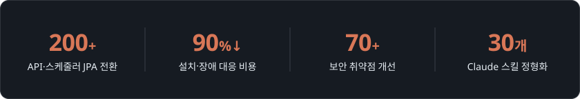

 

 

## 🏢 Career

> **이든티앤에스** · 기술연구소 대리 (백엔드 / 기술지원) `2024.02 ~ 재직 중`

- **[표준 Oracle 환경 대응을 위한 MyBatis → JPA/QueryDSL 리팩토링](https://tidal-badger-060.notion.site/Maria-DB-to-Oracle-Migration-1c65e3aabcb480c8a1a9d04997a407d4?pvs=4)**  
  └ Oracle 기준 DDL 재설계 · QueryDSL 전환으로 **은행권 수주**
- **RPM · Inno Setup 기반 설치 패키지 표준화**  
  └ Linux 8개 OS RPM · Windows 단일 .exe로 통일 (**34개 항목 자동 검증, 배포 용량 53%↓**)
- **[솔루션 보안 취약점 개선 및 고객사 납품 대응](https://tidal-badger-060.notion.site/28c5e3aabcb480ba8464fccbc5495d11?v=28c5e3aabcb4810f8aac000c48dd540d)**  
  └ 고객사마다 다른 보안 요구로 매번 개별 대응 → 과기정통부 「주요정보통신기반시설 기술적 취약점 분석·평가 방법(2021)」을 공통 기준으로 **조치·증빙 절차 표준화**
- **업무 프로세스 AX 전환**  
  └ **Claude 스킬 30개**로 개발 사이클 정형화 · Notion MCP 표준 문서 파이프라인 · openKB 사내 아카이브 챗봇

> **태화이노베이션** · SI사업부 사원 `2019.09 ~ 2020.07`

- **국민은행 해지 서류 분류 시스템 유지보수**

## 🛠 Stack

<table>
  <tr>
    <td><b>Language</b></td>
    <td>
      
      
      
    </td>
  </tr>
  <tr>
    <td><b>Backend / Frontend</b></td>
    <td>
      
      
      
    </td>
  </tr>
  <tr>
    <td><b>Database</b></td>
    <td>
      
      
      
    </td>
  </tr>
  <tr>
    <td><b>Infra / DevOps</b></td>
    <td>
      
      
      
      
      
      
      
    </td>
  </tr>
  <tr>
    <td><b>AI / AX</b></td>
    <td>
      
      
      
    </td>
  </tr>
</table>

## 📜 Certification

| 자격증 | 발급기관 | 취득 |
|:---|:---:|:---:|
| AWS Certified Solutions Architect – Associate | Amazon Web Services | 2026.09 |
| 정보처리기사 | 한국산업인력공단 | 2025.09 |
| 국가공인 SQL 개발자 (SQLD) | 한국데이터산업진흥원 | 2021.03 |
| 컴퓨터활용능력 1급 | 대한상공회의소 | 2020.12 |
